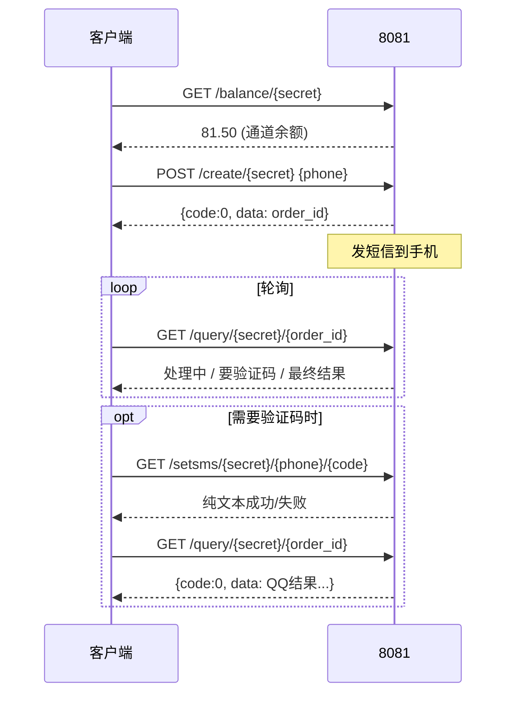
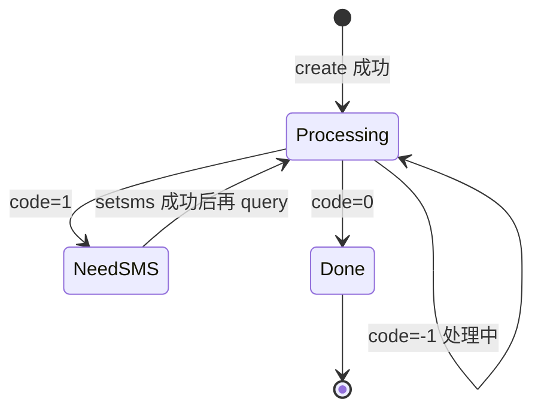

# 8081 查号接口与数据结构全解

时间：2026-07-07  
Base URL：`http://47.76.163.227:8081`  
服务：Kestrel (.NET)，**仅 HTTP**，无 Swagger  
探测工具：`python3 tools/probe_8081_api_spec.py`

---

## 一、查号完整流程（4 步）

这是官方客户端 / 你的 exe 实际走的链路，**不经过 9110 扣费**（旧 secret 直连时）：



| 步骤 | 接口 | 作用 |
|------|------|------|
| 0（可选） | `GET /balance` | 看通道还剩多少钱 |
| 1 | `POST /create` | 下单 + 触发发短信 |
| 2 | `GET /query` 轮询 | 看进度 / 拿结果 |
| 3 | `GET /setsms` | 用户收到短信后提交验证码 |
| 4 | 继续 `GET /query` | 直到 `code:0` |

---

## 二、接口明细

### 1. `GET /balance/{secret}`

**作用**：读取运营方 SMS 上游账户余额（不是用户余额）。

| 项 | 说明 |
|----|------|
| 鉴权 | URL 路径中的 `secret` |
| 成功响应 | 纯文本数字，如 `81.50` |
| Content-Type | `text/plain; charset=utf-8` |
| 失败 | 纯文本 `无效Token!`（HTTP 仍 200） |
| 大小写 | 路径 `/Balance/` 可用；secret 本身区分大小写 |

```http
GET /balance/18cdfb81a4e44a3a915528e67d923dba
→ 200
→ 81.50
```

---

### 2. `POST /create/{secret}`

**作用**：对手机号发起查号，创建订单，并触发短信。

**请求头**：`Content-Type: application/json`

**请求体**：

```json
{
  "area": "86",
  "data": "13800138000",
  "islink": false
}
```

| 字段 | 类型 | 必填 | 说明 |
|------|------|------|------|
| `area` | string | 否 | 区号，省略时默认按国内处理 |
| `data` | string | 是 | 手机号（`area`+`data` 组合） |
| `islink` | bool | 否 | `true` 为链接模式，普通查号用 `false` |

**成功响应**（JSON）：

```json
{
  "code": 0,
  "data": "78b3a3f5f94a4e4484992e84b6f02e57"
}
```

- `data` = **order_id**（32 位小写 hex，UUID 无连字符）
- 此时通道余额约 **-4 元**（成功下单即预扣/占用额度）

**错误响应**（均为 HTTP 200 + JSON）：

| code | err 示例 | 含义 |
|------|----------|------|
| `0` | — | 成功，`data`=order_id |
| `-1` | `有效数据：条\r\n单价：4.00元\r\n...\r\n余额不足!` | 通道余额不够（**泄露单价与余额**） |
| `-2` | `未检测到有效手机数据, 请检查输入格式` | 手机号格式非法 / `islink` 不匹配 |
| `-3` | `此手机号码已经正在进行查询，结束订单后提交` | 同号有进行中订单（卡单） |

**参数实测**：

| 用例 | 结果 |
|------|------|
| 缺 `area` | 仍成功 |
| `area:852` 香港号 | 成功 |
| `islink:true` + 普通号 | `-2` 格式错误 |
| body 加 `price`/`user` 等额外字段 | 忽略 |

---

### 3. `GET /query/{secret}/{order_id}`

**作用**：查询订单状态与最终结果（客户端每 3 秒轮询）。

**成功完成**（`code: 0`）— `data` 为 **多行纯文本**（嵌在 JSON 字符串里）：

```text
19900002112----未注册

订单扣费：0.00元
当前余额：73.50元
```

**结构化解析**：

| 行 / 字段 | 含义 | 示例 |
|-----------|------|------|
| 第一行 `手机号----状态` | 查号目标与结果 | `138xxxx----123456789`（QQ） |
| | | `199xxxx----未注册` |
| | | `199xxxx----未绑定` |
| `订单扣费：x.xx元` | 本单实际扣费 | `0.00元`（未注册可能不扣） |
| `当前余额：x.xx元` | **通道实时余额（泄露）** | `73.50元` |

> 成功时常见状态词：`未注册`、`未绑定`、`发送短信失败` 等；绑定了 QQ 时 `----` 后为 **QQ 号**。

**进行中 / 中间态**（`code: -1`）：

```json
{"err":"订单正在处理 ","code":-1}
```

**订单不存在**（`code: -1`）：

```json
{"err":"订单不存在","code":-1}
```

**等待用户输入短信验证码**（`code: 1`，需结合 `err`）：

```json
{"err":"请输入验证码 xxxx 或 ...","code":1}
```

- `err` 里可能带 **4–6 位数字**（有时会自动填到客户端）
- 此时应调 `setsms` 提交用户收到的验证码

**query 状态机**：



| code | 典型 err / data | 客户端动作 |
|------|-----------------|------------|
| `-1` | `订单正在处理` | 继续轮询 |
| `-1` | `订单不存在` | 停止（order_id 错或过期） |
| `1` | 含「请输入验证码」 | 调 setsms |
| `0` | `data` 含结果行 | 完成，解析 QQ |

---

### 4. `GET /setsms/{secret}/{phone}/{sms_code}`

**作用**：把用户手机收到的短信验证码交给 8081。

| 项 | 说明 |
|----|------|
| 方法 | GET 或 POST 均可（实测 POST 也 200） |
| phone | 与 create 时相同，URL 编码 |
| sms_code | 4–6 位验证码 |
| 响应 | **纯文本**，非 JSON |

**响应示例**：

|  body | 含义 |
|------|------|
| `没有该手机订单!` | 无进行中订单 / 订单已结束 |
| 含 `成功` | 验证码已接受（客户端据此判断） |
| 其他错误文案 | 验证码错误或流程异常 |

**注意**：

- 必须在 **query 提示需要验证码** 且订单仍活跃时调用
- **无限速**，可对同一号暴力试码（审计风险）

---

## 三、8081 里存了哪些「数据」

| 数据 | 存在形式 | 谁能读到 |
|------|----------|----------|
| 通道总余额 | `/balance` 明文；`query.data` 内嵌 | 持有 secret 者 |
| 单笔 order_id | create 返回 | 持有 secret 者 |
| 手机号 | create 提交；query 结果首行 | 持有 secret 者 |
| 查号结果（QQ 等） | query `data` 第一行 `----` 后 | 持有 secret 者 |
| 本单扣费 | query `data` | 持有 secret 者 |
| 内部单价 4 元 | create 余额不足 `err` | 持有 secret 者 |
| 订单列表 | **无 API** | 无法批量拉取，只能靠 order_id |
| 用户账号 | **不在 8081** | — |

**订单隔离**：每个 `secret` 只能 query 自己 create 出的 `order_id`；换 secret 查同一 order_id → `无效Token!`。

---

## 四、响应格式对照表

| 接口 | HTTP 成功码 |  body 类型 | 字段 |
|------|-------------|-----------|------|
| balance | 200 | 纯文本 | 数字 或 `无效Token!` |
| create | 200 | JSON | `code`, `data`/`err` |
| query | 200 | JSON | `code`, `data`/`err` |
| setsms | 200 | 纯文本 | 中文提示 |

**共同鉴权**：仅 URL 中的 `{secret}`，不支持 Header/Body 传 secret。

---

## 五、与 9110 的关系（计费）

```text
9110 用户 balance  →  仅展示，create 时不校验
8081 通道 balance  →  真正能不能下单、扣多少钱
9110 deduct_amount →  2.0 元（给用户看）
8081 内部单价       →  4.0 元（余额不足 err 泄露）
```

---

## 六、安全要点（运营方）

1. **secret = 根密钥**：拿到旧 secret 等于拿到全部 4 个接口的访问权  
2. **即使删掉 `/balance`**，`query` 成功仍泄露 `当前余额`  
3. **无订单列表**不等于安全：攻击者自己 create 就有 order_id  
4. **无取消接口**：`-3` 卡单会占住手机号一段时间  
5. **明文 HTTP**：secret、手机号、验证码、QQ 结果均可被中间人窃听  

---

## 七、复现

```bash
# 输出完整 JSON 探测报告
python3 tools/probe_8081_api_spec.py > /tmp/8081_report.json

# 快速路由扫描
python3 tools/deep_probe_8081.py
```

---

## 八、实测快照（本轮）

| 指标 | 值 |
|------|-----|
| 通道余额 | 81.50 → 73.50（探测消耗） |
| 有效路由 | **仅 4 个** |
| 完成一单耗时 | query 约 4–6 秒（未注册号，无需 setsms） |
| 未注册单扣费 | `订单扣费：0.00元` |
