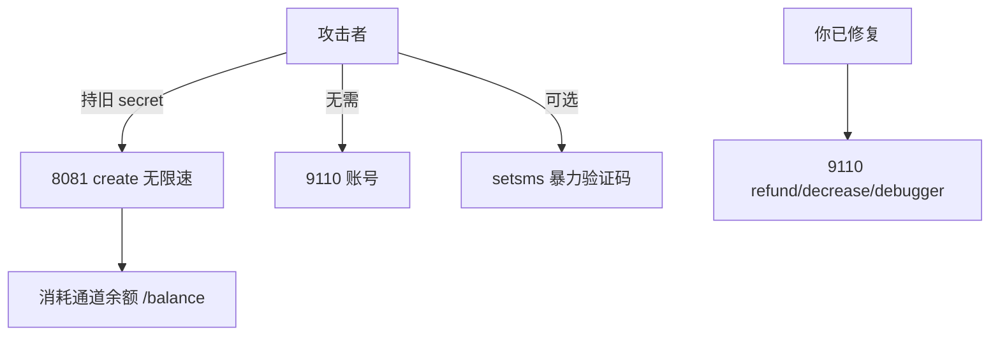

# 第三轮深挖补充（授权复测）

时间：2026-07-07 第二轮授权复测

---

## 新发现问题

### P1 — 8081 `create` 无速率限制

- **10 个不同手机号连续 create：10/10 成功**，耗时约 4.5 秒
- 无 IP 限速、无 CAPTCHA、无单日配额
- 结合旧 secret，可被脚本**批量占号 / 刷光通道余额**

**修复建议**：
```text
- 每 IP 每分钟 N 次 create
- 每 secret 每日上限
- 异常流量告警（对接 /balance 监控）
```

### P1 — 8081 `setsms` 无速率限制

- 20 次连续错误验证码约 8.8 秒，无封禁
- 可对同一 `phone+order` 暴力试 4–6 位验证码

**修复建议**：同手机号失败 5 次锁定 15 分钟。

### P2 — `user-info` 重复参数行为

```http
GET /user-info?username=合法用户&username=admin&token=合法token
→ 200，返回合法用户数据（后者 username 生效或校验绑定首个）

GET /user-info?username=admin&username=合法用户&token=合法token
→ 401 token invalid
```

当前逻辑下**无法跨用户读 admin**，但参数解析依赖框架默认行为，建议显式只取一个 `username` 并拒绝重复参数。

### P2 — Token 格式

- 长度 43，Base64URL 解码为 **32 字节随机数**
- 暴力预测不可行；风险在**泄露后永不过期**（前轮已记录）

### P2 — 订单号格式

- `order_id` 为 **32 位小写 hex**（无连字符 UUID）
- 随机性足够，**不可枚举**（抽样 query 均「订单不存在」）

### 观察 — 通道余额剧烈变化

| 时间 | `/balance` |
|------|------------|
| 早先复测 | ~81 → ~53 |
| 本轮 | **5.50**（后又观测到 69.50，说明有充值或并发消耗） |

说明旧 secret 在被持续使用，**吊销优先级极高**。

---

## 仍确认无效/低危

| 测试项 | 结果 |
|--------|------|
| secret 放 body/header 代替 path | 404，仅 path 有效 |
| 8081 新计费路径 pay/consume/deduct | 9110 均 404 |
| nginx 80/443 vhost 变异 | 均 openresty 404 |
| SQLi login/register | 未发现 |
| settings null byte key | 请求被拒绝 |

---

## 攻击面总览（给运营方）



**唯一仍需攻击者知道的**：泄露的旧 secret（曾在 settings 公网可读）。

---

## 回归验证

```bash
python3 tools/authorized_audit.py
```

P0 修复后额外手工验证：

```bash
# 1. 旧 secret 失效
curl -s -X POST "http://47.76.163.227:8081/create/18cdfb81..." \
  -H "Content-Type: application/json" \
  -d '{"area":"86","data":"13800138000","islink":false}'
# 期望: 无效Token!

# 2. create 限速（连续 20 次应触发 429）
```
