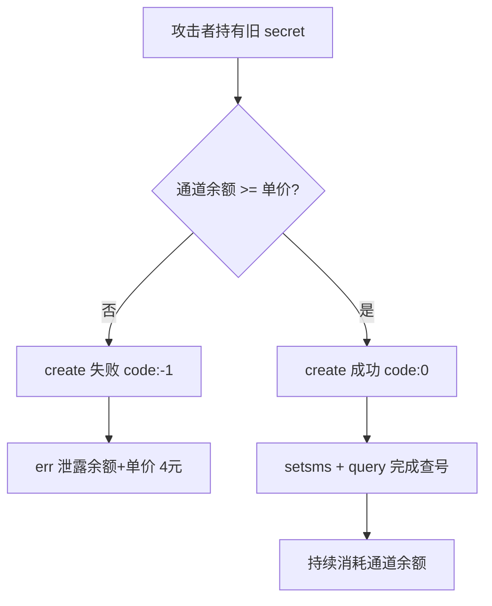

# 第四轮深挖（授权复测）

时间：2026-07-07

---

## 重大新发现

### 1. 8081 create 失败时泄露运营内部计费信息（P1）

当通道余额不足时，`create` 返回：

```json
{
  "code": -1,
  "err": "有效数据：条\r\n单价：4.00元\r\n总价：元\r\n余额：1.50元\r\n余额不足!"
}
```

**泄露内容**：
- 运营通道**实时余额**（与 `/balance` 一致）
- 内部**单价 4.00 元**（9110 `deduct_amount` 显示 2.0，**两套价格不一致**）
- 内部计费逻辑片段

**触发条件**：通道余额不足以覆盖本次 query 成本时（实测余额 **1.50 元** 时已无法 create）。

**修复**：错误信息改为通用文案，如 `{"code":-1,"err":"服务暂不可用"}`，不要返回余额/单价。

---

### 2. 8081 运营侧有余额校验，但与 9110 仍脱钩（P0 补充）

| 余额状态 | create 行为 |
|----------|-------------|
| 通道余额充足（如 >4 元） | **直接成功**，不查 9110 用户余额 |
| 通道余额不足 | 返回 `-1` + 泄露内部信息 |

结论：
- **旧 secret + 通道有钱** = 仍可白嫖
- 校验的是**你的通道钱包**，不是用户 `balance`

---

### 3. 并发 create 竞态（P2）

对同一手机号 8 线程并发 create：
- 1 个 `code:0` 成功
- 多个 `code:-3` 已进行中
- 部分 `code:-1` 余额不足

说明锁机制**基本有效**（不会无限双开），但在余额边界存在竞态。

---

### 4. 国际号码可用（P2 业务面）

```json
POST create {"area":"1","data":"2025550100","islink":false}
→ code:0
```

若业务仅面向国内号，应在 8081 限制 `area` 白名单。

---

### 5. 9110 注册约束放宽（P2）

| 测试 | 结果 |
|------|------|
| 用户名 128 字符 | 注册成功 |
| 密码空 / 纯空格 | 400 拒绝 |
| logout 接口 | 不存在（404） |

长用户名可用于日志污染 / 存储压力（低危）。

---

## 当前线上快照（本轮）

| 指标 | 值 |
|------|-----|
| 旧 secret create | **仍有效**（余额充足时） |
| settings secret | 8081 无效 |
| `/balance` | **1.50**（通道接近耗尽） |
| 内部单价（泄露） | **4.00 元/条** |
| 9110 deduct_amount | 2.0 元 |

---

## 攻击链更新（含余额边界）



---

## 修复建议（本轮新增）

```text
1. 【P0】吊销旧 secret（不变）
2. 【P1】create 错误信息去敏感化（余额/单价）
3. 【P1】下线 /balance 公网访问
4. 【P2】create 前统一走 9110 扣费，通道余额仅作底层告警
5. 【P2】area 白名单（若仅国内业务）
6. 【P2】用户名长度限制（如 <=32）
```

---

## 相关文档

- `analysis/SECURITY_HARDENING.md` — 总加固清单
- `analysis/ROUND3_FINDINGS.md` — 无限速问题
- `tools/authorized_audit.py` — 回归脚本
