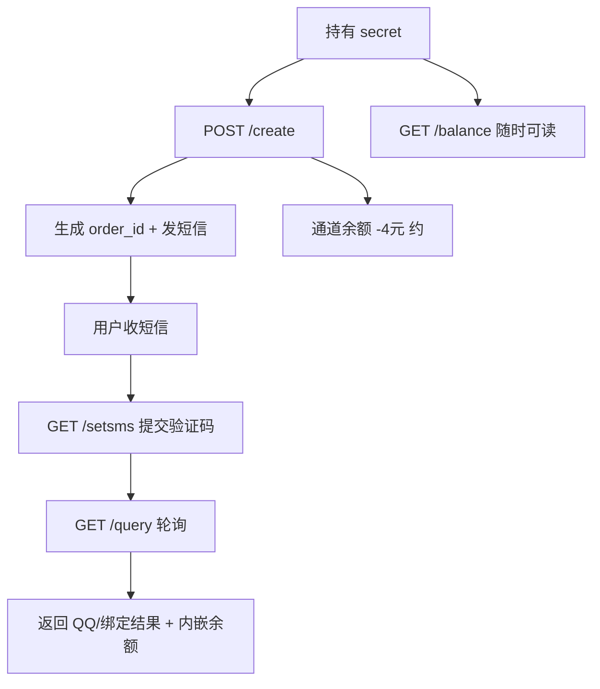

# 8081 专项深挖报告（第五轮）

时间：2026-07-07  
目标：`http://47.76.163.227:8081`（Kestrel / .NET）  
工具：`tools/deep_probe_8081.py` + 手工验证

---

## 结论先说

**8081 是整个查号业务的「发动机」**，但接口极少（仅 4 个），没有用户系统、没有后台页面、没有订单列表 API。

| 类别 | 在 8081 里有什么 |
|------|------------------|
| **钱** | 通道余额（全局）、单笔扣费、内部单价 4 元 |
| **业务** | 下单、发短信、收验证码、返回 QQ/绑定结果 |
| **订单** | `order_id`（32 位 hex）、手机号、处理状态 |
| **不在 8081** | 用户账号、token、注册、9110 配置、订单历史列表、取消订单 |

---

## 一、8081 完整攻击面（仅 4 路由）

扩展词表喷洒 + 常见 .NET 路径（swagger/health/admin 等）**全部 404**。

| 方法 | 路径 | 作用 |
|------|------|------|
| POST | `/create/{secret}` | 下单，body: `{"area","data","islink"}` |
| GET | `/query/{secret}/{order_id}` | 查结果 / 状态 |
| GET/POST | `/setsms/{secret}/{phone}/{code}` | 提交短信验证码 |
| GET | `/balance/{secret}` | **运营通道余额**（明文数字） |

**不存在的重要能力**（运营方可能以为有、实际没有）：

- 订单列表 `/orders`、历史 `/history` — **无**
- 取消/关闭订单 — **无**（卡单只能等超时）
- 管理后台 / Swagger — **无**
- HTTPS — **无**（仅 HTTP 8081）

---

## 二、8081 里「重要数据」详解

### 1. 通道余额（最敏感）

```http
GET /balance/18cdfb81a4e44a3a915528e67d923dba
→ 77.50
```

- 明文返回，无鉴权除 secret 外
- 路径大小写不敏感：`/Balance/` 亦可
- secret **区分大小写**（大写 → `无效Token!`）
- 实测探测中余额 **81.50 → 37.50**，每笔 create 约扣 **4 元**

### 2. 订单与查号结果

- `order_id`：32 位小写 hex（UUID 去连字符），**不可枚举**（随机 query 均「订单不存在」）
- 成功 `query` 的 `data` 示例：

```text
19900001899----未注册

订单扣费：0.00元
当前余额：77.50元
```

**新确认泄露（本轮）**：

| 泄露项 | 来源 | 严重度 |
|--------|------|--------|
| 手机号 | `query.data` | 中 |
| 查号结果（QQ/未注册等） | `query.data` | 高（业务核心） |
| **通道实时余额** | `query.data` 内 `当前余额` | **高** |
| 本单扣费 | `query.data` 内 `订单扣费` | 中 |
| 内部单价 4 元 | `create` 余额不足时 `err` | 高（前轮已记） |

> 即使封掉 `/balance`，攻击者仍可从**每次 query 成功响应**读到通道余额。

### 3. 短信验证码流程

- `setsms` 无活跃订单时 → `没有该手机订单!`
- 处理中 `query` → `{"err":"订单正在处理 ","code":-1}`
- 需验证码时 `err` 可能含 4–6 位数字（前轮已记）
- **setsms 无限速**（20 次错误验证码无封禁）

### 4. 计费逻辑（与 9110 完全独立）

| 场景 | 行为 |
|------|------|
| 通道余额充足 | create 直接成功，**不查 9110 用户余额** |
| 通道余额不足 | create 返回 `-1`，err 含余额/单价 |
| 未注册/失败单 | 本单扣费可能为 0.00 元（实测） |
| 9110 `deduct_amount` | 2.0 元（**与 8081 内部 4 元不一致**） |

---

## 三、新发现与补充

### P1 — `query` 成功响应内嵌通道余额

除 `/balance` 外，**每条完成的 query 都会在 `data` 尾部附带 `当前余额：xx.xx元`**。

**修复**：结果里只返回业务数据，删除余额/扣费行。

### P1 — 仍无速率限制

5 次连续 create **2.35 秒全部成功**，无 429 / Retry-After。

### P2 — 同号并发边界

- 第一单完成后，同号可再 create 一单
- 第二单进行中再 create → `code:-3`「此手机号码已经正在进行查询」
- 8 线程并发时仍有竞态（第四轮已记）

### P2 — 参数面

| 测试 | 结果 |
|------|------|
| 缺 `area` | 仍成功 |
| `area:852` 香港号 | 成功 |
| `islink:true` | 测试号返回格式错误 -2 |
| body 额外字段 `price`/`user` | 忽略，仍成功 |
| secret 仅认 URL path | body/header 无效 |

### P2 — 传输与指纹

- Server: `Kestrel`，无 `X-Powered-By`
- 无 CORS 头（OPTIONS → 405）
- 仅 **8081** 提供 HTTP；同 IP 其他端口（80/443/8080/8082/5000）连接被 reset

### P3 — secret 隔离

- 旧 secret 下的 `order_id`，用新 settings secret query → `无效Token!`
- 订单**按 secret 隔离**，但旧 secret 未吊销仍是 P0

---

## 四、8081 数据流（给运营方）



---

## 五、修复优先级（8081 专项）

| 优先级 | 项 |
|--------|-----|
| P0 | **立即吊销**旧 secret `18cdfb81...` |
| P0 | create/query **校验 9110 用户余额** 或废除直连 secret |
| P1 | 删除 `/balance` 或改为内网-only |
| P1 | query/create **错误与成功响应均不得含余额、单价** |
| P1 | IP + secret **限速**（create/setsms） |
| P2 | 提供**取消订单** API，避免 -3 卡单 |
| P2 | 上 HTTPS / IP 白名单 |
| P2 | 统一 9110 与 8081 单价 |

---

## 六、复现命令

```bash
python3 tools/deep_probe_8081.py
python3 tools/authorized_audit.py
```

---

## 七、当前快照

| 指标 | 值（探测时） |
|------|-------------|
| 旧 secret | **仍有效** |
| 通道余额 | ~77.50 元（波动中） |
| 内部单价 | 4.00 元/单（余额不足 err 泄露） |
| 有效路由数 | **4** |
| 限速 | **无** |
