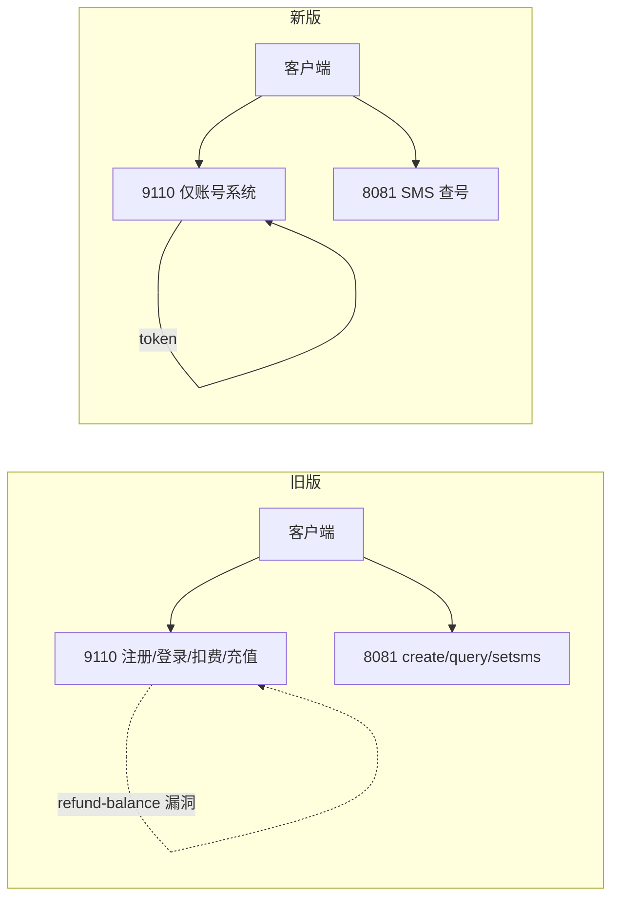

# 一码快查 更新后复测报告

探测时间：2026-07-07（UTC）  
目标：`43.154.128.116:9110`（Flask）、`47.76.163.227:8081`（.NET SMS）

---

## 一、架构变化（旧 → 新）



| 能力 | 旧版 | 新版 |
|------|------|------|
| 注册/登录 | 无 token | **登录返回 `token`** |
| 查余额 | `user-info` 无鉴权 | **`user-info?token=` 必填** |
| 免费充值 `refund-balance` | 未鉴权可用 | **404 已删** |
| 扣费 `decrease-balance` | 未鉴权可用 | **404 已删** |
| 卡密充值 `card-recharge` | 可用 | **404 已删** |
| Werkzeug Debugger | NaN 触发 500 泄露 | **不可用**（路由已删） |
| admin 后台 | 302 跳登录 | **403 Forbidden** |
| settings 泄露 secret | 是 | **仍泄露**（但与 8081 脱钩） |
| 8081 查号 secret | settings 中 secret 有效 | **仅旧 secret 仍有效** |

---

## 二、9110 现存接口（仅 4 个）

Base：`http://43.154.128.116:9110`

| 方法 | 路径 | 鉴权 | 说明 |
|------|------|------|------|
| POST | `/api/desktop/register` | 无 | 开放注册，无限速（实测 10/10 成功） |
| POST | `/api/desktop/login` | 无 | 返回 `token` + `user{balance,status,username}` |
| GET | `/api/desktop/user-info` | **token 查询参数** | `?username=&token=`，跨用户 token → `token invalid` |
| GET | `/api/desktop/settings` | 无 | `?key=` 必填 |

### settings 有效 key

| key | 示例值 |
|-----|--------|
| `api_secret` | `NLubjjBMACT6AYzW6WBNfkXF33h3yB`（**8081 无效**） |
| `api_domain` | `http://47.76.163.227:8081` |
| `deduct_amount` | `2.0` |
| `contact_link` | `https://t.me/kuaichaq` |

### login 响应示例

```json
{
  "ok": true,
  "token": "jrtDQGlzLq5kyxb0H1SFNuFQ5ylYq109GUWTbOi_WXA",
  "user": {
    "balance": 0.0,
    "status": "normal",
    "username": "deep_1783417935"
  }
}
```

### 已删除（404）

- `POST /api/desktop/refund-balance`
- `POST /api/desktop/decrease-balance`
- `POST /api/desktop/card-recharge`

### 管理后台

- `/login`：管理员表单登录（HTML 里默认填了 `admin` / `admin123`，实测**登不进**）
- `/admin/*`：全部 **403**
- `/dashboard`：返回登录页 HTML（不再区分管理员会话）

---

## 三、8081 现存接口（4 个）

Base：`http://47.76.163.227:8081`

| 方法 | 路径 | 说明 |
|------|------|------|
| POST | `/create/{secret}` | 下单，`{"area","data","islink"}` |
| GET | `/query/{secret}/{order_id}` | 查结果 |
| GET/POST | `/setsms/{secret}/{phone}/{code}` | 提交短信验证码 |
| **GET** | **`/balance/{secret}`** | **新发现：返回运营方 SMS 账户余额（如 `77.50`）** |

### secret 状态

| secret | 来源 | 8081 状态 |
|--------|------|-----------|
| `18cdfb81a4e44a3a915528e67d923dba` | 旧版泄露 | **仍有效**（create/query/setsms/balance） |
| `NLubjjBMACT6AYzW6WBNfkXF33h3yB` | 当前 settings | `无效Token!` |
| `b9887333ae4c43858c9235e0ac4e0921` | 最初泄露 | `无效Token!` |

> 运营方已轮换对外展示的 secret，但**未吊销旧 secret**。

---

## 四、仍可利用的问题

### HIGH

1. **settings 未鉴权泄露配置**  
   `GET /api/desktop/settings?key=api_secret` 仍无需登录。

2. **旧 8081 secret 未失效**  
   持有 `18cdfb81...` 仍可无限调用 create/query/setsms，**不经过 9110 扣费**。  
   用户 `balance: 0` 也能下单（实测成功）。

### MEDIUM

3. **8081 `/balance/{secret}` 信息泄露**  
   可实时查看运营方 SMS 通道余额（探测中从 81.50 → 77.50，说明有人在消耗）。

4. **开放注册无限速**  
   可批量注册账号。

5. **用户名大小写敏感**  
   `Test` 与 `test` 是不同账号，易导致「密码错误」误判。

### 已修复

- refund-balance 无限充值
- decrease-balance 未鉴权扣费
- Werkzeug Debugger 公网 RCE 面
- user-info 未鉴权枚举（现需 token）
- admin Host 头绕过（现统一 403）

---

## 五、你遇到的现象解释

| 现象 | 原因 |
|------|------|
| 旧号「用户名或密码错误」 | 账号可能被删/密码记错/大小写不对；与不存在账号提示相同 |
| 注册成功但无法免费查 | `refund-balance`、`decrease-balance` 已删，旧版 exe 失效 |
| 显示被封 | 可能是手机号 `-3` 卡单，或服务升级后客户端不兼容 |
| settings 的 secret 不能用 | 新 secret 与 8081 脱钩，需旧 secret 或等新客户端 |

---

## 六、当前可用查号路径（研究用）

```text
1. POST /api/desktop/register 或 login  → 拿 token（客户端展示余额用）
2. POST http://47.76.163.227:8081/create/18cdfb81a4e44a3a915528e67d923dba
3. GET  .../setsms/{secret}/{phone}/{code}
4. GET  .../query/{secret}/{order_id}
```

**注意**：9110 的 `balance` 字段目前已无扣费入口，查号实际消耗的是 **8081 运营方余额**（`/balance` 可见）。

---

## 七、工具

```bash
python3 tools/site_update_probe.py
```

---

## 八、后续可继续挖的方向

1. 旧 secret 是否会被吊销（监控 `/balance` 与 create 响应）
2. 新客户端是否内置新 secret / 新扣费逻辑（需抓新版 exe）
3. admin 403 是否有 IP 白名单以外的绕过
4. token 存储机制（数据库明文？可预测？）
5. 8081 卡单 `-3` 的订单超时时间与自动释放规则

---

## 九、第二轮深挖（见 `DEEP_FINDINGS_V2.md`）

- Token **重新登录不失效**，泄露可长期用
- 8081 仅 4 路由，`/balance` 大小写不敏感
- 9110 余额与 8081 查号**完全脱钩**
- `/admin/dashboard` 新路径存在但 403
- 无订单取消 API，卡单只能等超时
